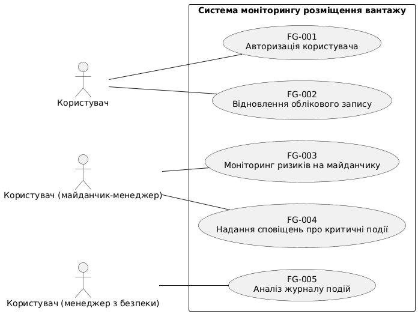

```
@startuml
left to right direction

actor "Користувач" as user
actor "Користувач (майданчик-менеджер)" as manager_builder
actor "Користувач (менеджер з безпеки)" as manager_security

rectangle "Система моніторингу розміщення вантажу" {
    usecase "FG-001\nАвторизація користувача" as fg1
    usecase "FG-002\nВідновлення облікового запису" as fg2
    usecase "FG-003\nМоніторинг ризиків на майданчику" as fg3
    usecase "FG-004\nНадання сповіщень про критичні події" as fg4
    usecase "FG-005\nАналіз журналу подій" as fg5

    user -- fg1
    user -- fg2
    manager_builder -- fg3
    manager_builder -- fg4
    manager_security -- fg5
}
@enduml

```