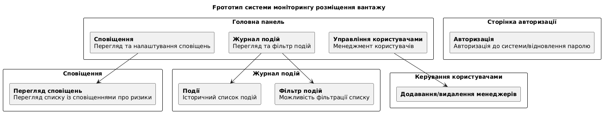

```
@startuml
skinparam rectangle {
    BorderColor black
}
title Прототип cистеми моніторингу розміщення вантажу

rectangle "<b>Головна панель</b>" {
    rectangle "<b>Сповіщення</b>\nПерегляд та налаштування сповіщень" as Notification
    rectangle "<b>Журнал подій</b>\nПерегляд та фільтр подій" as Log
    rectangle "<b>Управління користувачами</b>\nМенеджмент користувачів" as UsersManage
}

rectangle "<b>Сторінка авторизації</b>" {
    rectangle "<b>Авторизація</b>\nАвторизація до системи/відновлення паролю" as Auth
}

rectangle "<b>Сповіщення</b>" {
    rectangle "<b>Перегляд сповіщень</b>\nПерегляд списку із сповіщеннями про ризики" as NotificationGroup
}

rectangle "<b>Журнал подій</b>" {
    rectangle "<b>Події</b>\nІсторичний список подій" as Logs
    rectangle "<b>Фільтр подій</b>\nМожливість фільтрації списку" as LogFilters
}

rectangle "<b>Керування користувачами</b>" {
    rectangle "<b>Додавання/видалення менеджерів</b>" as ManageUsers
}

Notification --> NotificationGroup
Log--> Logs
Log--> LogFilters
UsersManage--> ManageUsers
@enduml
```