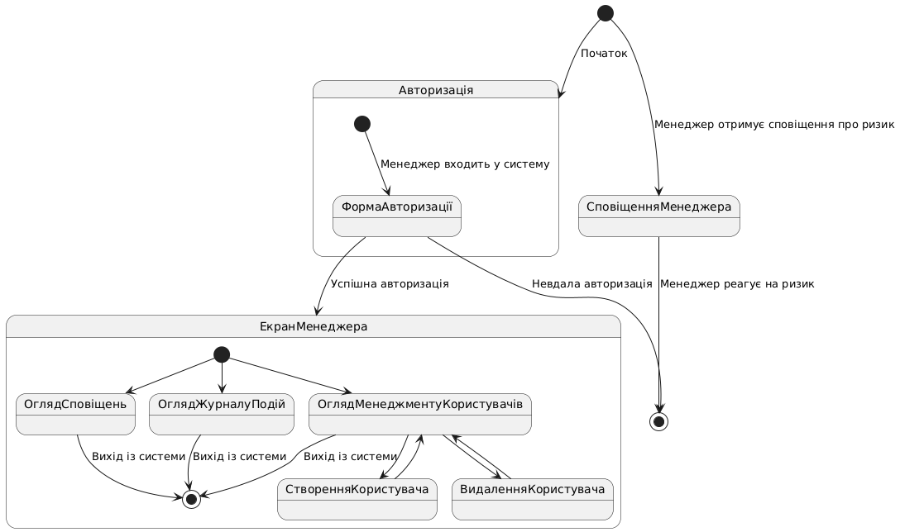

# Проект каркасу програми

## Діаграма

## 1. Екран авторизації
- **Опис**: Екран для входу в систему, доступний тільки для менеджерів.
- **Елементи**:
  - Поля:
    - "Ім’я користувача"
    - "Пароль"
  - Кнопка:
    - "Увійти"
- **Переходи**:
  - Успішна авторизація веде до **головного екрана**.
  - Невдала авторизація залишається на поточному екрані із відповідним повідомленням про помилку.

---

## 2. Головний екран
- **Опис**: Головний екран на який потрапляє менеджер, з якого доступні функції моніторингу, управління користувачами та перегляду подій.
- **Елементи**:
  - Розділи:
    - "Огляд сповіщень"
    - "Журнал подій"
    - "Менеджмент користувачів"
  - Кнопка "Вийти".
- **Переходи**:
  - Вибір "Огляд сповіщень" переходить до **екрану сповіщень**.
  - Вибір "Журнал подій" переходить до **екрану перегляду подій**.
  - Вибір "Менеджмент користувачів" переходить до **екрану управління користувачами**.

---

## 3. Екран огляду сповіщень
- **Опис**: Екран для перегляду поточних сповіщень про ризики, які система визначила.
- **Елементи**:
  - Таблиця:
    - "Перегляд таблиці поточних сповіщень".

---

## 4. Екран журналу подій
- **Опис**: Інтерфейс для перегляду історії подій, пов’язаних із ризиками.
- **Елементи**:
  - Таблиця з подіями:
    - Колонки: "Дата", "Тип ризику", "Локація", "Стан".
  - Фільтри:
    - За датою.
    - За типом ризику.
- **Переходи**:
  - Використання фільтрів оновлює список подій.

---

## 5. Екран менеджменту користувачів
- **Опис**: Екран для управління обліковими записами користувачів системи.
- **Елементи**:
  - Список користувачів із можливістю вибору.
  - Кнопки:
    - "Створити нового користувача".
    - "Видалити користувача".
    - "Редагувати користувача".
