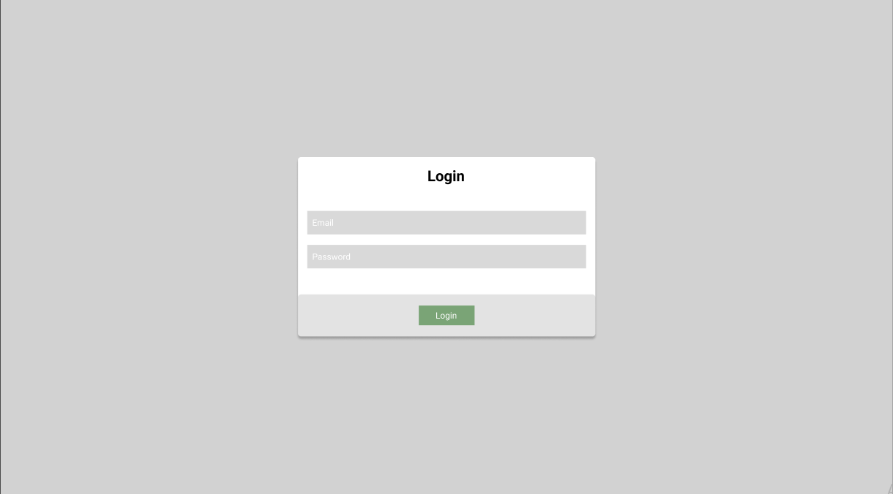
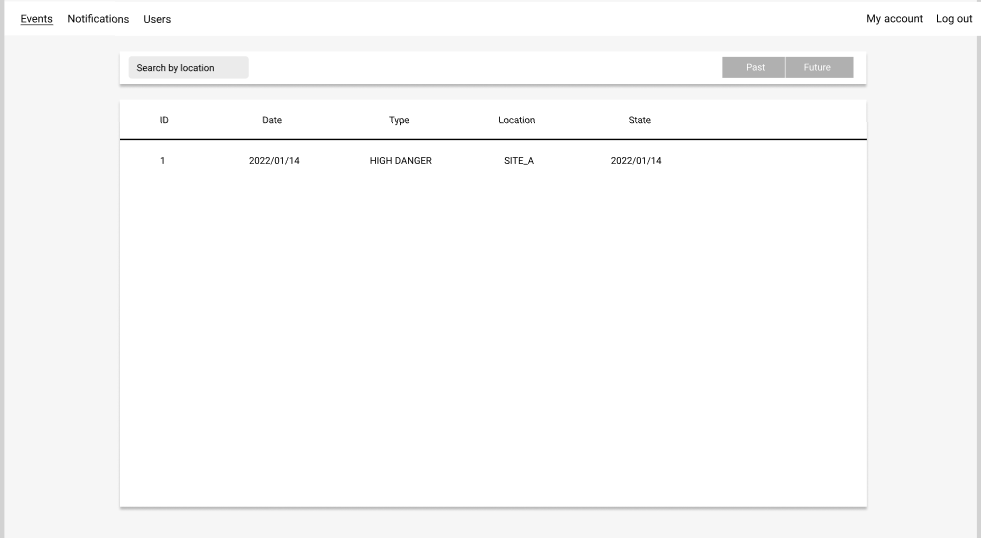
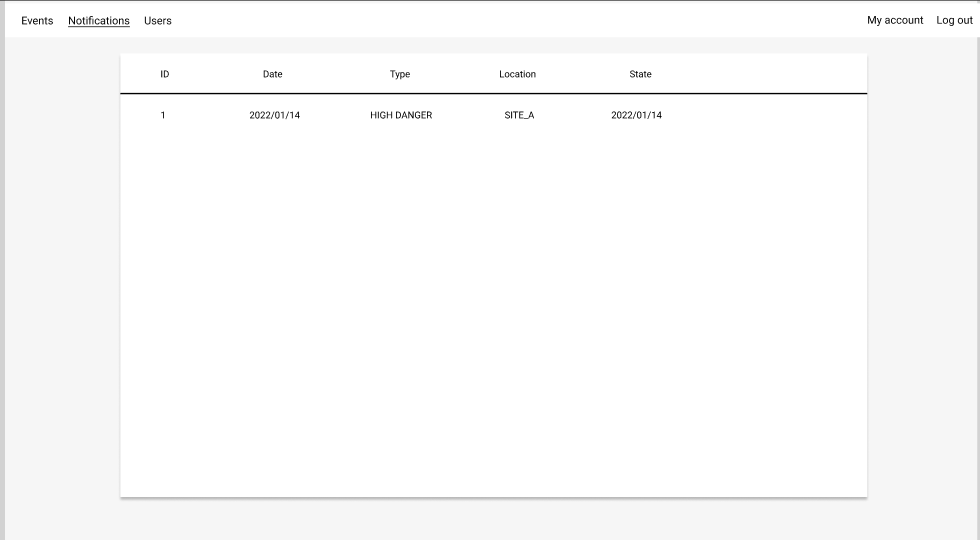
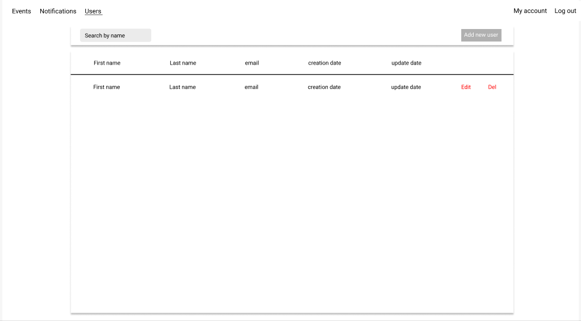
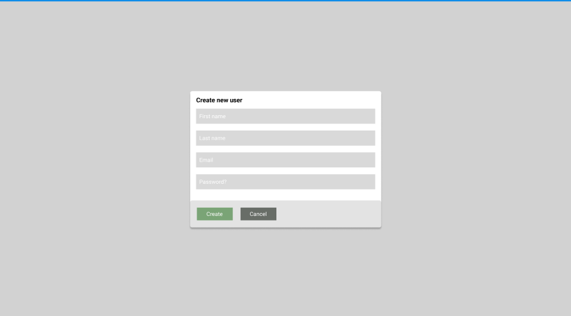

# Макети програмного забезпечення

## **NFR_1 - Екран авторизації**

### Елементи:
1. **Форма для введення даних**:
   - Поле для введення логіну (підпис: "Ім’я користувача").
   - Поле для введення паролю (підпис: "Пароль").
   - Кнопка "Увійти" для підтвердження введених даних.

2. **Повідомлення про помилку**:
   - У разі некоректного введення з’являється текстове повідомлення:  
     _"Неправильне ім’я користувача або пароль. Спробуйте ще раз"_.

### Переходи:
- Успішний вхід виконує перехід на **головний екран**.
- Невдала авторизація залишає користувача на поточному екрані.

---

## **NFR_2 - Головний екран**

### Елементи:
1. **Розділи**:
   - "Огляд сповіщень" — відкриває екран перегляду сповіщень.
   - "Журнал подій" — відкриває екран історії подій.
   - "Менеджмент користувачів" — відкриває екран управління користувачами.

2. **Додаткові елементи**:
   - Кнопка "Вийти" — повертає до екрану авторизації.

### Переходи:
- Вибір кожного розділу виконує перехід на відповідний екран.

---

## **NFR_3 - Екран огляду сповіщень**

### Елементи:
1. **Основний контент**:
   - Таблиця з поточними сповіщеннями, яка включає основну інформацію про ризики, визначені системою.

2. **Оновлення**:
   - Дані в таблиці оновлюються в реальному часі за мірою появи нових сповіщень.

---

## **NFR_4 - Екран журналу подій**

### Елементи:
1. **Таблиця з подіями**:
   - Колонки:
      - _"Дата"_ — дата та час події.
      - _"Тип ризику"_ — категорія ризику.
      - _"Локація"_ — місце, де було зафіксовано ризик.
      - _"Стан"_ — статус події (наприклад, "Вирішено" чи "Відкрито").

2. **Фільтри**:
   - Фільтр за датою — дозволяє обрати часовий діапазон.
   - Пошук по локації

### Переходи:
- Використання фільтрів автоматично оновлює відображений список подій.

---

## **NFR_5 - Екран менеджменту користувачів**

### Елементи:
1. **Список користувачів**:
   - Відображає усіх існуючих користувачів із можливістю вибору.

2. **Функціональні кнопки**:
   - "Створити нового користувача" — відкриває форму для створення облікового запису.
   - "Видалити користувача" — видаляє вибраного користувача з бази.

### Підтвердження:
- Усі дії вимагають підтвердження перед застосуванням.
