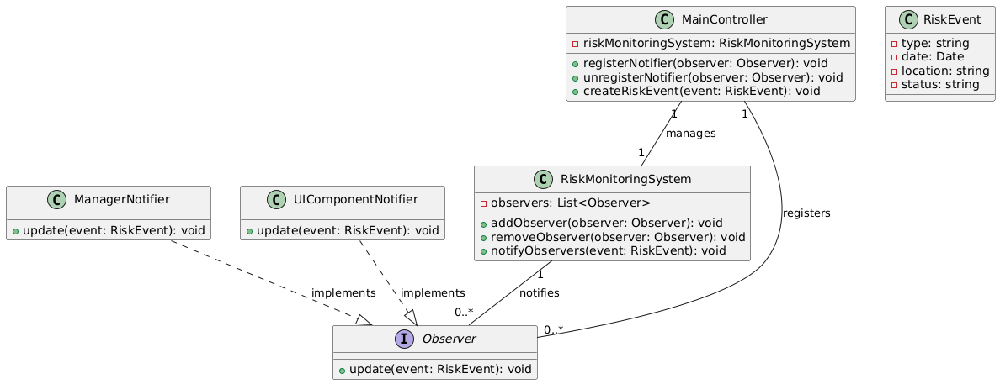

## Пропонований шаблон проектування: Спостерігач

## Специфікація класів

### 1. Клас `RiskMonitoringSystem` (Суб’єкт спостереження)
- **Призначення**: Керує списком спостерігачів і повідомляє їх про зміни стану ризиків.
- **Поля**:
  - `observers: List<Observer>` — список підписаних спостерігачів.
- **Методи**:
  - `addObserver(observer: Observer): void` — додає нового спостерігача до списку.
  - `removeObserver(observer: Observer): void` — видаляє спостерігача зі списку.
  - `notifyObservers(event: RiskEvent): void` — повідомляє всіх спостерігачів про подію.

---

### 2. Інтерфейс `Observer` (Спостерігач)
- **Призначення**: Визначає інтерфейс для отримання оновлень від суб’єкта.
- **Метод**:
  - `update(event: RiskEvent): void` — отримує оновлення про зміну стану ризику.

---

### 3. Клас `ManagerNotifier` (Сповіщення Менеджера)
- **Призначення**: Реалізує поведінку спостерігача для надсилання сповіщень менеджерам.
- **Реалізує**: `Observer`.
- **Методи**:
  - `update(event: RiskEvent): void` — надсилає повідомлення менеджерам про ризик.

---

### 4. Клас `UIComponentNotifier` (Сповіщення Інтерфейсу)
- **Призначення**: Реалізує поведінку спостерігача для оновлення користувацького інтерфейсу.
- **Реалізує**: `Observer`.
- **Методи**:
  - `update(event: RiskEvent): void` — оновлює інтерфейс відповідно до нового ризику.

---

### 5. Клас `RiskEvent` (Подія Ризику)
- **Призначення**: Представляє інформацію про подію ризику.
- **Поля**:
  - `type: string` — тип ризику.
  - `date: Date` — дата й час події.
  - `location: string` — місце, де було зафіксовано ризик.
  - `status: string` — статус події (наприклад, "Вирішено" або "Відкрито").

---

### 6. Клас `MainController` (Основний Контролер)
- **Призначення**: Координує взаємодію між компонентами системи.
- **Поля**:
  - `riskMonitoringSystem: RiskMonitoringSystem` — екземпляр суб’єкта для керування спостерігачами.
- **Методи**:
  - `registerNotifier(observer: Observer): void` — реєструє нового спостерігача в системі.
  - `unregisterNotifier(observer: Observer): void` — видаляє спостерігача із системи.
  - `createRiskEvent(event: RiskEvent): void` — додає нову подію ризику та повідомляє всіх спостерігачів.

---

## Обґрунтування вибору шаблону
Шаблон Спостерігач (Observer) ідеально підходить для програмного продукту, який включає аналіз і сповіщення про ризики на основі даних IoT. Система повинна в реальному часі інформувати декілька компонентів (напр., менеджерів, екрани моніторингу) про зміну стану ризиків.

**Шаблон Спостерігач підходить для цього програмного продукту, оскільки він забезпечує:**
- Реактивність системи
- Дані про нові ризики чи зміни станів автоматично надходять усім зацікавленим компонентам (UI, email-сповіщення тощо).
- Гнучкість і масштабованість
- Легко додавати нових спостерігачів (наприклад, інші канали сповіщення) без змін основного класу.
- Зниження зв’язності
- RiskMonitoringSystem не залежить від деталей реалізації спостерігачів, що спрощує модифікацію та підтримку.
- Підходить для IoT-систем
- Дані з пристроїв IoT можуть генерувати події, які швидко розповсюджуються за допомогою Observer, забезпечуючи реальний час.

---